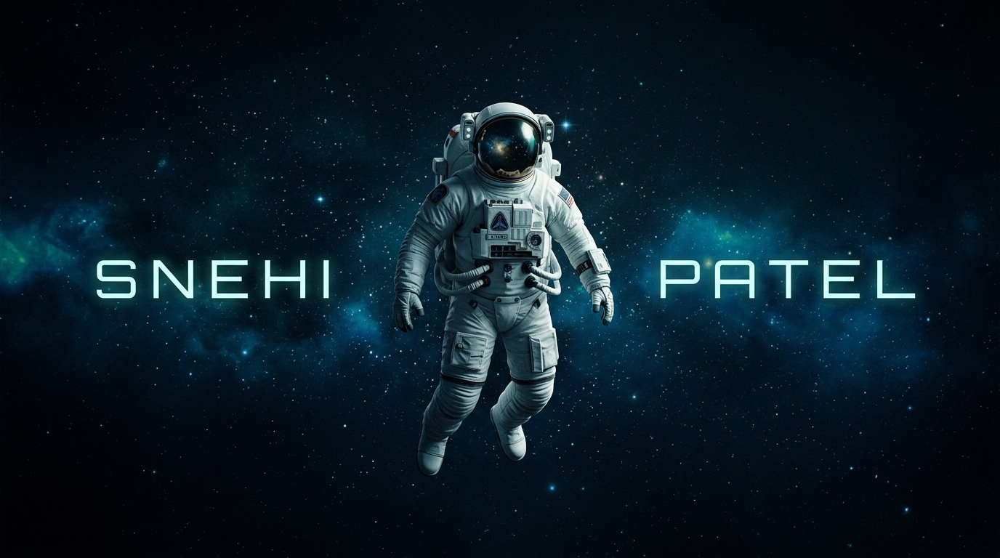

<!-- ╔══════════════════════════════════════════════════════════════════════╗ -->
<!-- ║                    🚀 SPACE + CODE THEME README                     ║ -->
<!-- ╚══════════════════════════════════════════════════════════════════════╝ -->

<div align="center">

<!-- ═══════════════════════ SPACE BANNER ═══════════════════════ -->



<br/>

<!-- ═══════════════════════ GREETING ═══════════════════════ -->

## Hi 👋, I'm Snehi

**AI & ML Engineer | Full Stack Developer | Builder**

> *Turning raw data into intelligence, one model at a time*

<br/>

[](https://git.io/typing-svg)

<br/>

[](https://github.com/snehipatel)
&nbsp;&nbsp;
[](https://github.com/snehipatel)

</div>

<!-- ═══════════════════════════════════════════════════════════ -->


<!-- ═══════════════════════ ABOUT ME ═══════════════════════ -->

<div align="center">

## 🧑‍🚀 About Me

</div>

```python
class SnehiPatel:
    def __init__(self):
        self.name        = "Snehi Patel"
        self.role        = "AI & ML Engineer | Full Stack Developer"
        self.university  = "L.D. College of Engineering — B.Tech AI & ML"
        self.diploma     = "Diploma in IT — CGPA 9.60/10.00"
        self.location    = "📍 Ahmedabad, Gujarat, India"

    def current_focus(self):
        return [
            "🌙 Detecting subsurface water ice on the Lunar South Pole",
            "🌍 Building an AI-Powered Climate Digital Twin of India",
            "🏆 Leading teams to hackathon wins",
            "📊 Mastering ML/DL, Computer Vision & Geospatial Data"
        ]

    def ask_me_about(self):
        return ["Machine Learning", "Deep Learning", "Computer Vision",
                "Climate & Geospatial Data", "Full Stack Dev", "Agentic AI"]

    def fun_fact(self):
        return "I debug .GRD files faster than I finish my coffee ☕"

me = SnehiPatel()
```

My days basically go: dream up a concept → build it → break it → fix the bug I definitely just created → repeat until it works → act surprised when it works.

Aggressively hands-on, mildly caffeinated, permanently turning wild ideas into reality — powered by an unreasonable amount of love, coffee, and code (in that exact order; don't @ me).

<!-- ═══════════════════════════════════════════════════════════ -->


<!-- ═══════════════════════ CONNECT ═══════════════════════ -->

<div align="center">

## 💜 Connect

<br/>

<a href="https://www.linkedin.com/in/snehi26"></a>
&nbsp;
<a href="https://nandishpatel.lovable.app"></a>
&nbsp;
<a href="https://github.com/snehipatel"></a>
&nbsp;
<a href="mailto:snehipatel2612@gmail.com"></a>
&nbsp;
<a href="https://teamup.net.in"></a>

<br/>

</div>

<!-- ═══════════════════════════════════════════════════════════ -->


<!-- ═══════════════════════ TECH STACK ═══════════════════════ -->

<div align="center">

## 🛠 Tech Stack

<br/>

<!-- Languages -->


<br/><br/>

<!-- AI/ML -->

&nbsp;&nbsp;


<br/><br/>

<!-- Frontend / Full Stack -->


<br/><br/>

<!-- Databases & Tools -->


<br/><br/>

<!-- BI & Data Viz -->


</div>

<!-- ═══════════════════════════════════════════════════════════ -->


<!-- ═══════════════════════ GITHUB STATS ═══════════════════════ -->

<div align="center">

## 📊 GitHub Stats

<br/>


&nbsp;&nbsp;


<br/><br/>


</div>

<!-- ═══════════════════════════════════════════════════════════ -->


<!-- ═══════════════════════ ACTIVITY GRAPH ═══════════════════════ -->

<div align="center">

## 📈 Activity Graph

<br/>

[](https://github.com/ashutosh00710/github-readme-activity-graph)

</div>

<!-- ═══════════════════════════════════════════════════════════ -->


<!-- ═══════════════════════ COMMIT ACTIVITY ═══════════════════════ -->

<div align="center">

## ⌛ Commit Activity

<br/>


</div>

<!-- ═══════════════════════════════════════════════════════════ -->


<!-- ═══════════════════════ TROPHIES ═══════════════════════ -->

<div align="center">

## 🏆 GitHub Trophies

<br/>

[](https://github.com/ryo-ma/github-profile-trophy)

</div>

<!-- ═══════════════════════════════════════════════════════════ -->


<!-- ═══════════════════════ FEATURED PROJECTS ═══════════════════════ -->

<div align="center">

## 🚀 Featured Projects

</div>

<table>
<tr>

<td width="50%" valign="top">

### 🌙 Lunar South Pole Ice Detection
> *Six-Module ML/DL System Architecture*

<p>
  
</p>

🔭 Detects subsurface **water ice** in doubly shadowed craters using multi-sensor fusion  
📊 Built on **NASA LRO, Chandrayaan-2 & SELENE/Kaguya** datasets  
🔄 6-module pipeline: terrain → thermal → spectral → fusion → prediction → visualization

`Python` `Deep Learning` `Remote Sensing` `Geospatial` `CNN`

[](#)
[](#)

</td>

<td width="50%" valign="top">

### 🌍 AI Climate Digital Twin of India
> *ISRO BAH 2026 — Problem Statement 5*

<p>
  
</p>

🛰 Ingesting **75 years** of IMD gridded data + **INSAT-3D/3DR** satellite LST  
📈 LightGBM pipeline with **SPI targets**, **ETCCDI indices** & **Mann-Kendall** trend analysis  
🗺 Interactive 3D visualization of climate predictions across all Indian states

`LightGBM` `XGBoost` `Rasterio` `React` `D3.js` `Three.js`

[](#)
[](#)

</td>

</tr>

<tr>

<td width="50%" valign="top">

### 🎓 CampusX
> *MERN Full Stack Platform*

<p>
  
</p>

🎯 Campus technical event management — **137-file** production codebase  
🔒 JWT auth, RBAC, **13 MongoDB collections**, dark glassmorphism UI  
👥 Multi-role dashboards for students, organizers, and admins

`React` `Express` `MongoDB` `JWT` `TailwindCSS`

[](#)
[](#)

</td>

<td width="50%" valign="top">

### 🚌 TransitOps
> *8-Hour Hackathon Speed Build*

<p>
  
</p>

🗺 Real-time public transit operations dashboard  
⚡ Built in 8 hours under hackathon pressure  
📊 Live tracking, route optimization & analytics

`React` `Node.js` `MongoDB` `MapboxGL`

[](#)
[](#)

</td>

</tr>
</table>

<!-- ═══════════════════════════════════════════════════════════ -->


<!-- ═══════════════════════ ACHIEVEMENTS ═══════════════════════ -->

<div align="center">

## 🏅 Achievements & Highlights

<br/>

| 🏷 | Achievement | Details |
|:---:|:---|:---|
| 🥇 | **Diploma Topper** | Information Technology — **9.60 / 10.00 CGPA** |
| 🛰️ | **ISRO BAH 2026** | Led full team through Problem Statement 5 — Climate Digital Twin of India |
| 🌙 | **Lunar Ice Research** | Designed a 6-module ML/DL architecture for subsurface ice detection |
| 🚀 | **Production Apps** | Built and shipped multiple production-grade full-stack applications |
| 🧠 | **Hackathon Leader** | Repeat team lead — dashboards, ML pipelines & full apps under tight deadlines |
| 🛠 | **TeamUp Founder** | Built & deployed a team collaboration platform at [teamup.net.in](https://teamup.net.in) |

</div>

<!-- ═══════════════════════════════════════════════════════════ -->


<!-- ═══════════════════════ EXPERIENCE ═══════════════════════ -->

<div align="center">

## 💼 Experience

```
🚀  PROFESSIONAL JOURNEY
```

</div>

<table>
<tr>
<td width="80">

**2024**

</td>
<td>

### 🤖 AI/ML Intern — Legato Web Technologies

> `Intelligent Automation` `Predictive Modeling` `Model Development`

- Engineered AI/ML solutions involving **intelligent automation** and **predictive analytics**
- Led model development lifecycle: data preprocessing → experimentation → performance evaluation
- Integrated AI solutions into production applications, improving decision-making workflows

</td>
</tr>
<tr>
<td width="80">

**2023**

</td>
<td>

### 💻 Web Development Intern — HRP Infra Pvt. Ltd.

> `Frontend` `UI/UX` `Backend Integration`

- Designed and developed **responsive corporate websites** for the company
- Delivered frontend interfaces, UI improvements, and backend integration
- Contributed to **production websites** including HRP Infra and HRP BIM

</td>
</tr>
</table>

<!-- ═══════════════════════════════════════════════════════════ -->


<!-- ═══════════════════════ PHILOSOPHY ═══════════════════════ -->

<div align="center">

## ⌛ Philosophy

<br/>


<br/><br/>

*"When you want something, all the universe conspires in helping you to achieve it."*  
— **Paulo Coelho**

</div>

<!-- ═══════════════════════════════════════════════════════════ -->


<!-- ═══════════════════════ FOOTER ═══════════════════════ -->

<div align="center">

### 🌌 Let's Connect & Build the Future Together

<br/>

<a href="https://www.linkedin.com/in/snehi26"></a>
&nbsp;
<a href="mailto:snehipatel2612@gmail.com"></a>
&nbsp;
<a href="https://nandishpatel.lovable.app"></a>
&nbsp;
<a href="https://teamup.net.in"></a>

<br/><br/>

> **⭐ If you find my projects interesting, consider giving them a star! It motivates me to build more. ⭐**

<br/>


</div>
